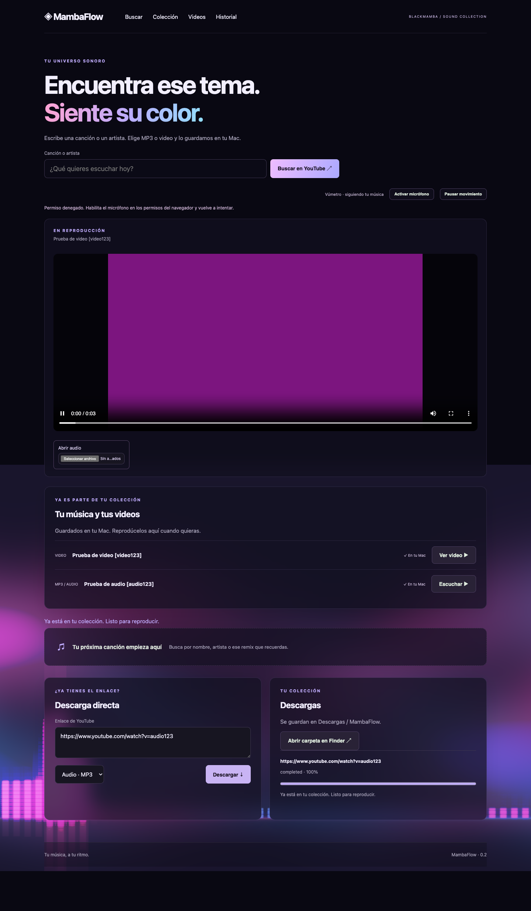

# MambaFlow · Emission

Busca una canción o artista en YouTube, guarda MP3 o video y escucha tu colección con un visualizador que reacciona al audio. Fondo inmersivo de color con vúmetro de 48 bandas. Interfaz local en español, basada en el Emission Engine de BlackMamba: shaders de emisión, bloom y reflejos con una paleta rosa, violeta y cian.



## Abrir en Mac

Abre **MambaFlow.app**. El lanzador inicia una sola instancia en un puerto local libre y abre la interfaz en tu navegador. No necesitas localizar la carpeta del proyecto. Los archivos se guardan en `~/Downloads/MambaFlow/{audio,video}`; historial y logs en `~/Library/Application Support/MambaFlow`.

La aplicación empaqueta Python y sus dependencias. Esta versión requiere **ffmpeg instalado** (`brew install ffmpeg`) para convertir audio y combinar video. El DMG es una compilación local para Apple Silicon, todavía sin firma Developer ID ni notarización.

## Desarrollo

```sh
python3 -m venv .venv
.venv/bin/pip install -r requirements-lock.txt
bin/mambaflow
```

Validado con Python 3.14 en macOS arm64. El archivo lock registra el entorno exacto de compilación. `requirements.txt` expresa dependencias generales.

```sh
.venv/bin/python -m pytest -q
./packaging/build.sh --dmg
```

## Uso

1. Escribe una canción o artista y pulsa Buscar.
2. Elige MP3 o Video. La cola muestra progreso y permite cancelar.
3. La colección de la pantalla principal se actualiza automáticamente al terminar. Pulsa Escuchar o Ver video. Los archivos existentes se reutilizan por ID y formato, incluso después de reiniciar.
4. Pausa el movimiento cuando quieras. La preferencia del sistema de reducir movimiento se respeta al iniciar.

Los archivos locales se reproducen en el navegador; no se suben. La búsqueda consulta YouTube; sus miniaturas pueden cargarse desde servidores de YouTube. El botón Activar micrófono solicita permiso al navegador. Su señal se analiza localmente, sin grabarla, subirla ni enviarla a los altavoces. Apagar micrófono detiene la captura.

## Límites de esta versión

- Admite enlaces HTTPS de YouTube; la cola se limita a 100 trabajos pendientes y 20 enlaces por trabajo.
- Búsquedas de hasta 200 caracteres, ocho resultados y caché de dos minutos. Las búsquedas se serializan fuera del bucle del servidor.
- Historial atómico de hasta 1.000 entradas; cola pendiente no persistente entre reinicios.
- Cancelar es cooperativo: una operación de red o conversión activa puede tardar en detenerse.
- El formato solicitado para video es MP4; algunos códecs originales podrían no reproducirse en todos los navegadores.
- YouTube puede exigir autenticación o cambiar sus mecanismos. No se garantiza la descarga de todo contenido.
- El navegador sigue siendo la ventana de la interfaz. Cerrar su pestaña no detiene el servidor; se puede terminar MambaFlow desde Monitor de Actividad.

## Publicación

Consulta [preparación de release](docs/RELEASE.md), [validación](docs/VALIDATION.md) y [arquitectura](docs/ARCHITECTURE.md). La copia anidada histórica `blackmamba-ytdlp/` no participa en la aplicación ni en el paquete de fuentes.
